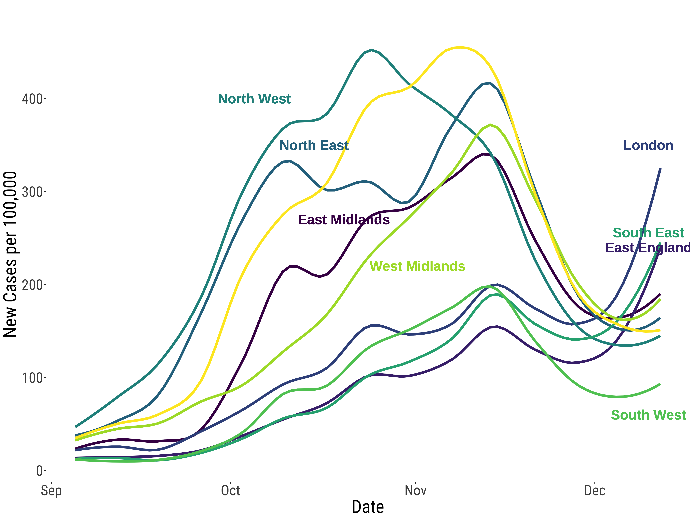

# Visualisation of COVID19 trends and patterns

[Francisco Rowe](http://www.franciscorowe.com) [[`@fcorowe`](http://twitter.com/fcorowe)]1*

1 *Geographic Data Science Lab, University of Liverpool, Liverpool, United Kingdom*

* *Correspondence*:
F.Rowe-Gonzalez@liverpool.ac.uk

This repository contains visualisation of COVID19 trends and patterns. At the moment it contains code for the items below, but there is more to come once I consolidate all of the visualisations that I have created and are dispersed across various places.

* Time trend plots of Wave 2 by Region

